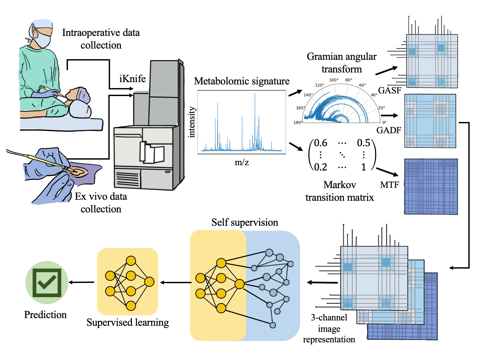

### ImSpect: Image-driven Self-supervised Learning for Surgical Margin Evaluation with Mass Spectrometry

Laura Connolly[^1], Fahimeh Fooladgar[^2], Amoon Jamzad[^1], Martin Kaufmann, ...., Purang Abolmaesumi[^2], Parvin Mousavi[^1]

[^1]: Queen's University
[^2]: University of British Columbia



#### Purpose: 
Real-time assessment of surgical margins is critical for favourable outcomes in cancer patients. The iKnife is a mass spectrometry device that has demonstrated potential for margin detection in cancer surgery. Previous studies have shown that using deep learning on iKnife data can facilitate real-time tissue characterization. However, none of the existing literature on the iKnife facilitate the use of publicly available, state-of-the-art pre-trained networks or datasets that have been used in computer vision and other domains. 
#### Methods: 
In a new framework we call ImSpect, we convert 1D iKnife data, captured during basal cell carcinoma (BCC) surgery, into 2D images in order to capitalize on state-of-the-art image classification networks. We also use self-supervision to leverage large amounts of unlabelled, intraoperative data to accommodate the data requirements of these networks. 
#### Results: 
Through extensive ablation studies we show that we can surpass previous benchmarks of margin evaluation in BCC surgery using iKnife data, achieving an area under the receiver operating characteristic curve (AUC) of 81.6\%. We also depict the attention maps of the developed DL models to evaluate the biological relevance of the embedding space
of the models. 
#### Conclusions: 
We propose a new method for characterizing tissue at the surgical margins, using mass spectrometry data from cancer surgery.


---

<!-- -->
  >> Codes will be uploaded soon ...

## Running the code

<!-- First you need to install dependencies by running `pip install -r requirements.txt`. -->

### 1. Self-Supervised Learning: 
You can run the code ... 
```
python train_ssl.py --arch resnet18 --epochs 300 --lr 0.2 
```

---
### 2. Supervised Learning:
You can run the code ... 
```
python train_sup.py --exp-dir <experiment-dir>  --pretrained <path-of-pretrained-ssl-model> --arch resnet18 --epochs 300  --lr-head 0.2 --lr-backbone 0.002 
```

---

## Cite ImSpect
<pre>
</pre>
